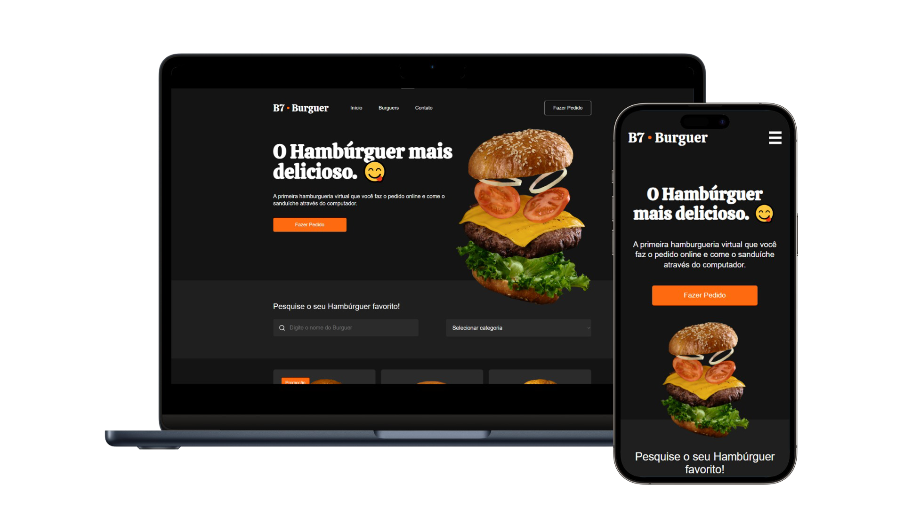

# B7Burguer

    

Projeto desenvolvido como parte do curso da B7Web, focado em práticas de front-end com HTML e CSS.

Este site é totalmente estático, sem funcionalidades interativas, pois o objetivo principal foi exercitar a estruturação e o design de páginas web.

Confira o projeto online: [🔗Acessar página](https://devjuliomartins.github.io/B7Burguer/).
